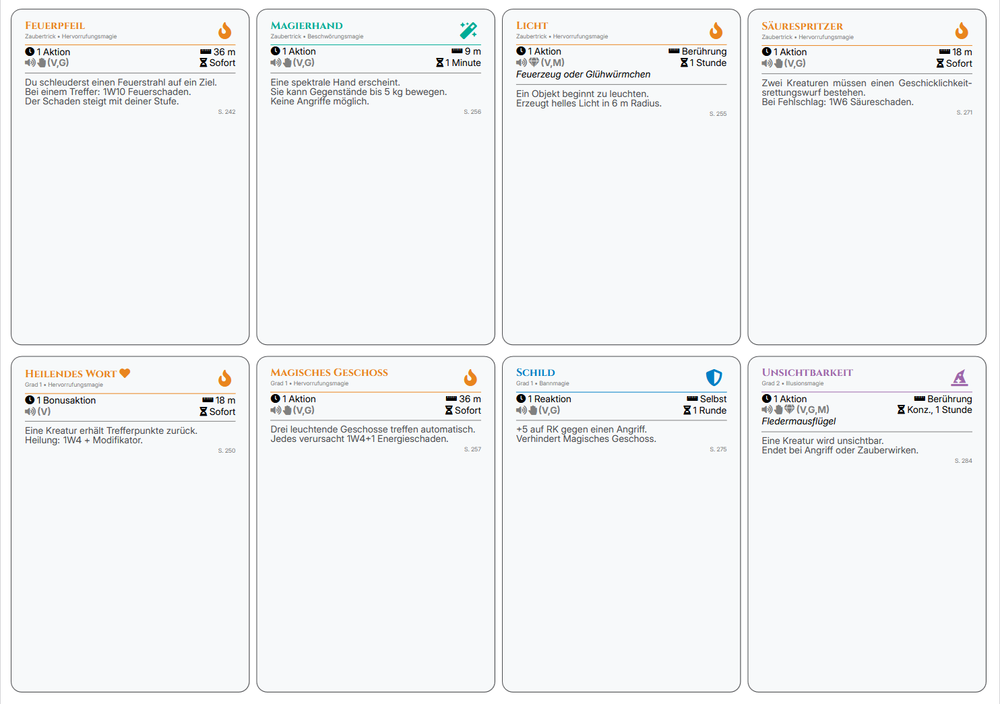

# 🧙 DnD Spellcards Generator


A minimal, code-driven generator for **printable D&D 5e spell cards** using LaTeX.

No UI. No overhead. Just fast iteration and full control over layout and design.

---

## 📸 Preview



---

## ✨ Features

- Print-ready **PDF spell cards**
- Modular LaTeX structure for easy customization
- Spell school colors & icon system
- Optimized for **home printing (A4 grid layout)**
- Fast workflow: edit → compile → print
- Supports **German PHB 2024 spell formatting**

---

## 🚀 Getting Started

### Requirements

- LaTeX distribution (recommended: **XeLaTeX**)
- Common packages:
  - `fontspec`
  - `xcolor`
  - `geometry`
  - `tikz` *(optional depending on version)*

---

### Compile

```bash
xelatex cards.tex
````

---

## 🧩 Card Structure

```latex
\begin{spellcard}

\spellheader
  {Feuerpfeil}
  {hervorrufungsmagie}
  {Zaubertrick (Stufe 0) • \getschoolname{hervorrufungsmagie}}

\vspace{1mm}

\spellmeta
  {1 Aktion}
  {36 m}
  {V,S}
  {Sofort}

\spelldesc{
Du schleuderst einen Feuerstrahl auf ein Ziel...
}

\end{spellcard}
```

---

## 🛠️ Customization

### Spell Schools

```latex
\getschoolname{hervorrufungsmagie}
```

---

### Layout System

| Command        | Purpose                 |
| -------------- | ----------------------- |
| `\spellheader` | Title, school, level    |
| `\spellmeta`   | Casting details + icons |
| `\spelldesc`   | Description             |

---

### Print Layout

* Multiple cards per page
* A4 optimized
* Cut-friendly spacing
* Home printer tested

---

## 📚 Data

Spell data is based on **D&D 5e (PHB 2024)**.

> This repository does not include copyrighted spell datasets by default.

---

## 📍 Repository

👉 [DnD Spellcards Generator](https://github.com/lgreil/DnD-Spellcards-Generator?utm_source=chatgpt.com)

---

## 🤝 Contributing

PRs welcome.

---

## ⚠️ Disclaimer

Fan-made project.
Not affiliated with Wizards of the Coast.

---

## 🧭 Roadmap

* [ ] JSON → LaTeX pipeline
* [ ] Auto icon detection
* [ ] Multi-language support
* [ ] Duplex / card backs
* [ ] Web preview tool

```

---

## 🔥 Optional upgrade (HIGHLY recommended)

If you want one **really sexy badge upgrade**, add a build badge via GitHub Actions:

### 1. Create file:
```

.github/workflows/latex.yml

````

### 2. Paste this:

```yaml
name: Build LaTeX PDF

on:
  push:
  pull_request:

jobs:
  build:
    runs-on: ubuntu-latest

    steps:
      - uses: actions/checkout@v4

      - name: Compile LaTeX
        uses: xu-cheng/latex-action@v3
        with:
          root_file: cards.tex
````

### 3. Then add this badge at the top:

```md

```
